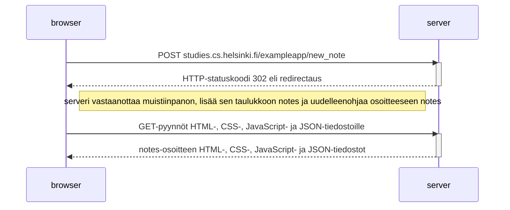

```mermaid
sequenceDiagram
    participant browser
    participant server
    
    browser->>server: POST studies.cs.helsinki.fi/exampleapp/new_note
    activate server
    server-->>browser: HTTP-statuskoodi 302 eli redirectaus
    deactivate server
    
    Note right of browser: serveri vastaanottaa muistiinpanon, lisää sen taulukkoon notes ja uudelleenohjaa osoitteeseen notes

    browser->>server: GET-pyynnöt HTML-, CSS-, JavaScript- ja JSON-tiedostoille
    activate server
    server-->>browser: notes-osoitteen HTML-, CSS-, JavaScript- ja JSON-tiedostot
    deactivate server
```