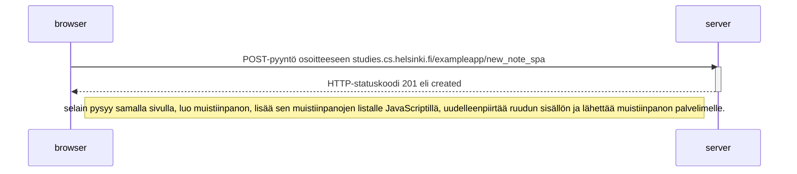

```mermaid
sequenceDiagram
    participant browser
    participant server
    
    browser->>server: POST-pyyntö osoitteeseen studies.cs.helsinki.fi/exampleapp/new_note_spa
    activate server
    server-->>browser: HTTP-statuskoodi 201 eli created
    deactivate server
    
    Note right of browser: selain pysyy samalla sivulla, luo muistiinpanon, lisää sen muistiinpanojen listalle JavaScriptillä, uudelleenpiirtää ruudun sisällön ja lähettää muistiinpanon palvelimelle.
```